# NCDN-FUS
Image analysis codes of confocal image z-stacks used to produce figures 4f (FUS granules) and 6b (cytoplasmic NCDN) in paper:

**A postzygotic de novo NCDN mutation identified in a sporadic FTLD patient results in Neurochondrin haploinsufficiency and altered FUS granule dynamics.**

## Cytoplasmic NCDN

[`Norbin_CytoplasmIntensity_allslices_AllCytoplasm.py`](Norbin_Cytoplasmic/) must be run for each experimental week. It takes as input the path to a folder containing .lsm files from the Zeiss confocal organized in subfolders with the condition names (PLKO, shFUS315, shFUS318). [Example image stacks of each condition are provided.](Norbin_Cytoplasmic/Example_Data/)

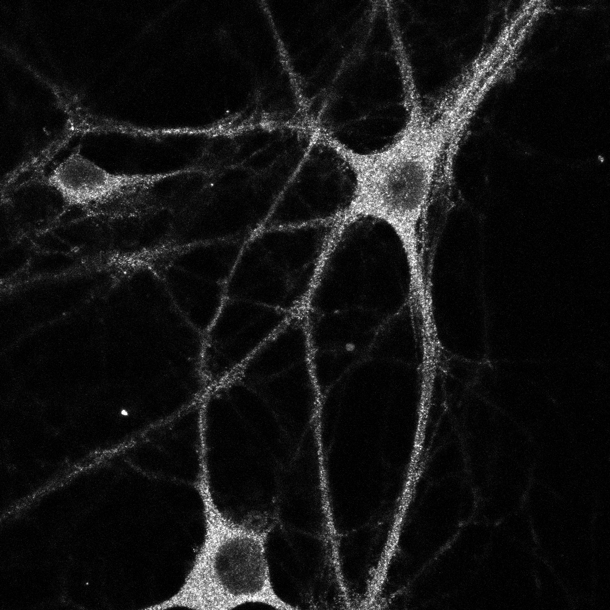 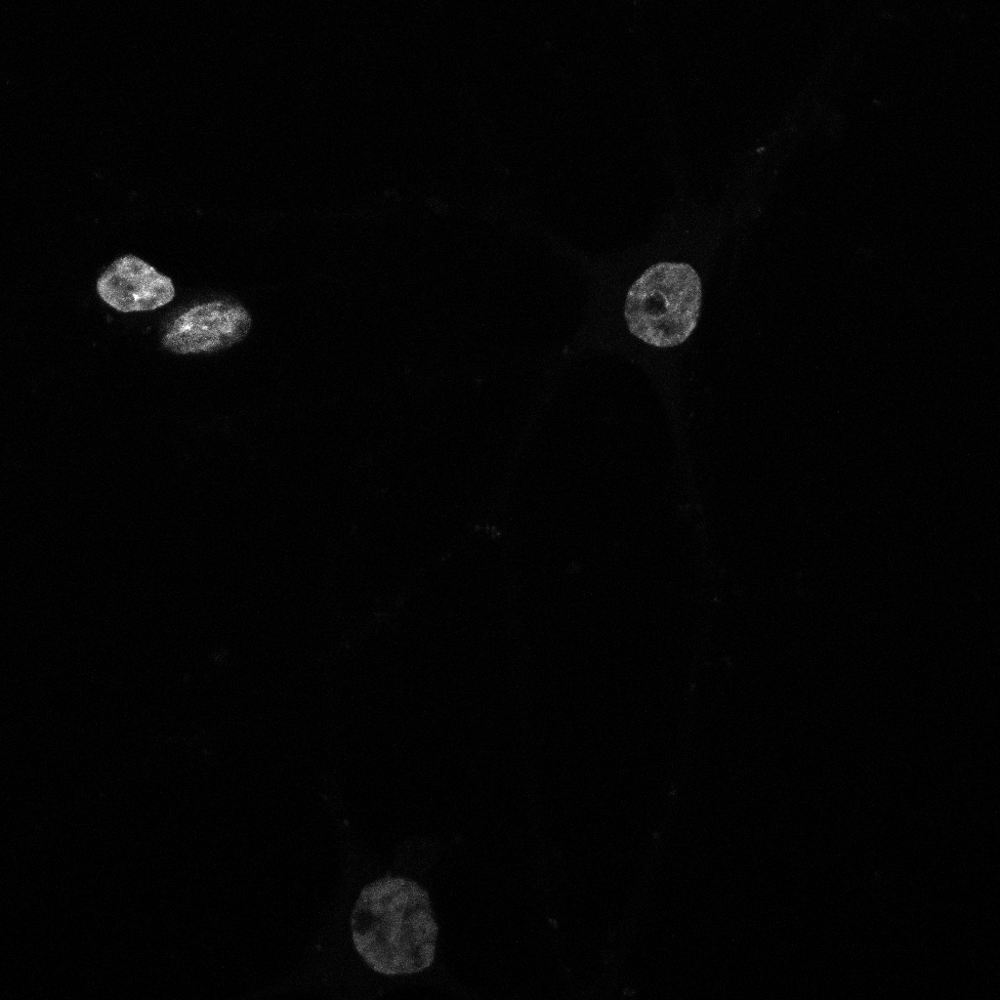

It returns a foreground mask, a nucleus mask and the masked intensity of the Norbin channel for each image. It also produces a csv file containing the median intensity of each image and a .npy file containing the histogram data of all the images. These files are saved to a folder named masks_+date+_NCDN 

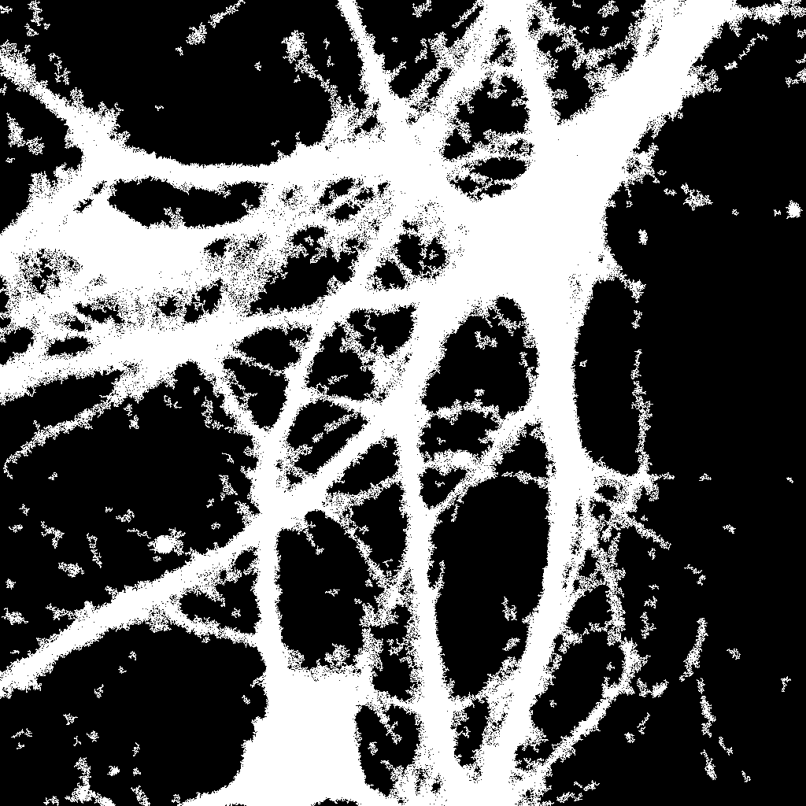 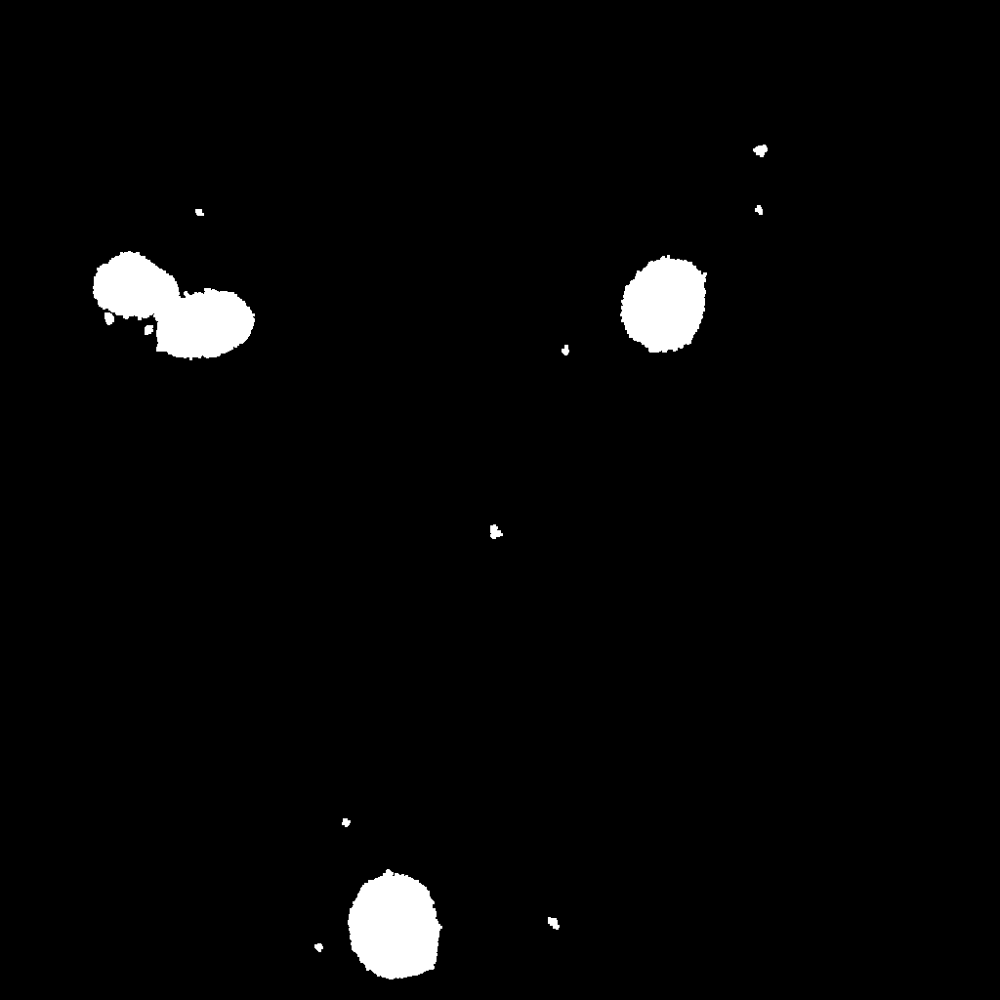 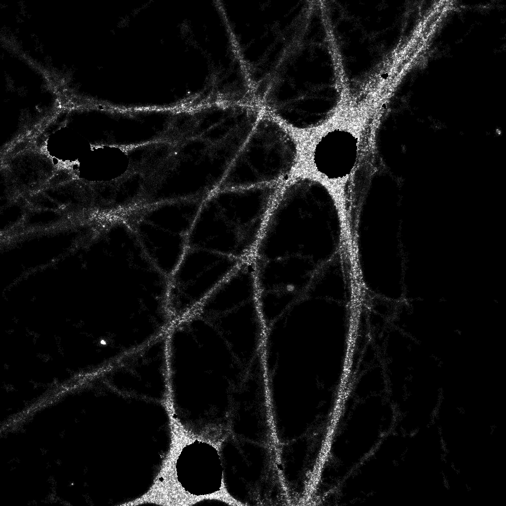

The produced csv files can then be taken as input by `NCDN_CummingsPlot_Alldates.py` which calculates the bootstrapped differences between conditions and produces the Cummings Plot as shown below. The csv files from all experimental dates included in the paper are available [here](Norbin_Cytoplasmic/Norbincumcurve/Example_Data)

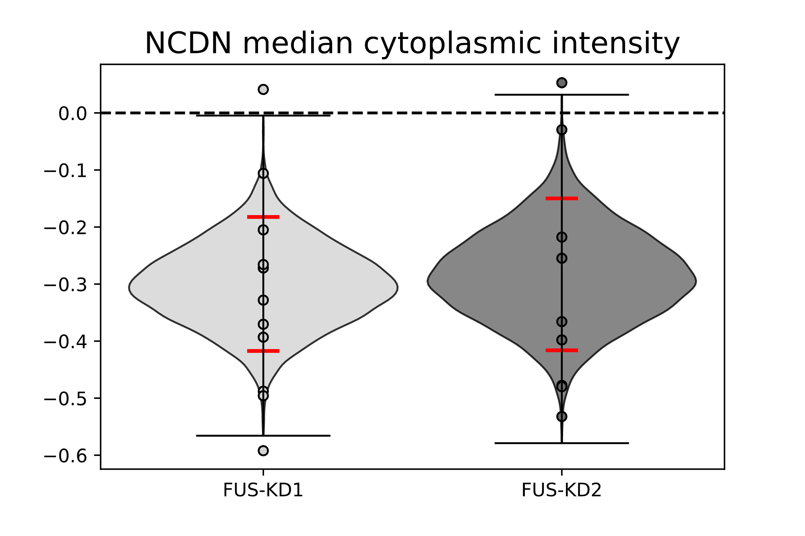

## FUS granules

Since the segmentation parameters were slightly adjusted for each experimental week, a separate python code with the appropriate parameters was produced. For example, [`SliceSegmentation_LSM_2shFus_3DAICS_slicequantification_Fusclusters_2021data_statsCDF.py`](fusgranules/) contains all the paths and parameters to analyze the data acquired on 12-04-2021. This code takes as input the path to a folder containing .lsm files from the Zeiss confocal organized in subfolders with the condition names (PLKO, shNorbin01, shNorbin02). [Example image stacks of each condition from 12-04-2021 are provided.](fusgranules/Example_Data/)

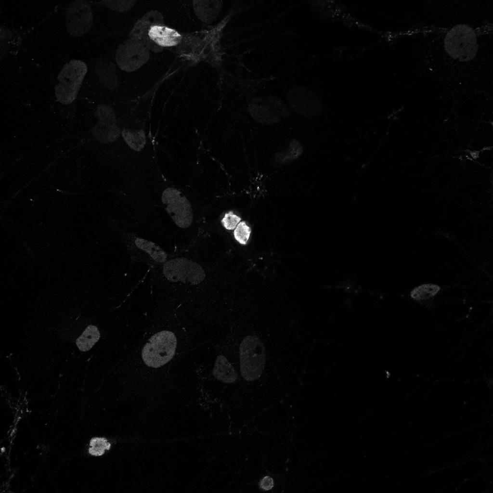 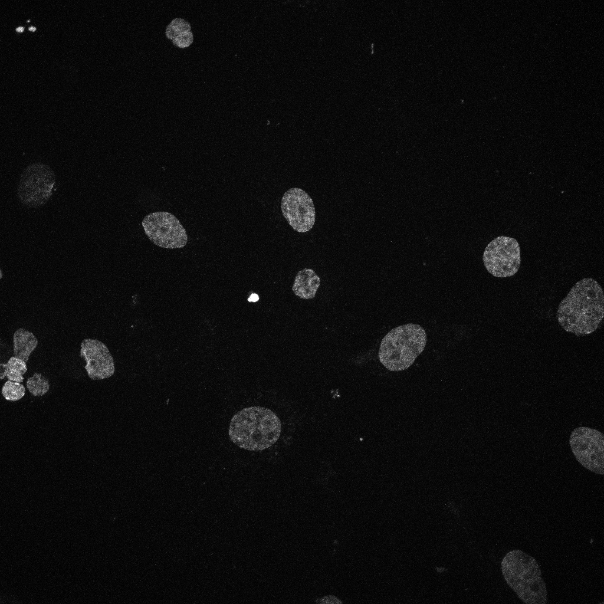

It returns a nucleus mask and a mask of the FUS granules who respect the established thresholds for size and intensity for each image. It also returns a .npy array containing a dictionnary of the intensities of all the segmented clusters and the number of clusters for each image structured by knockdown condition. These files are saved to a folder named masks_+date+_FusGranules

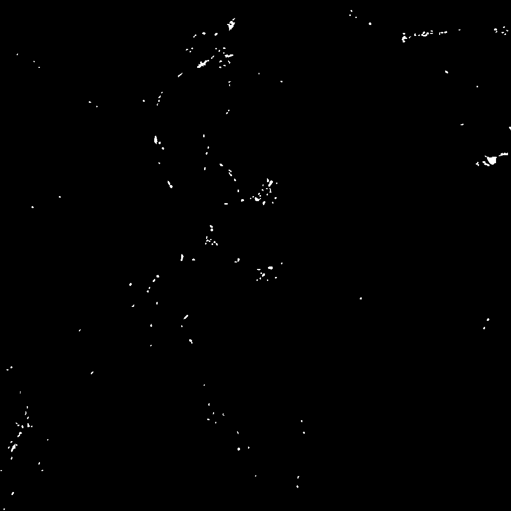 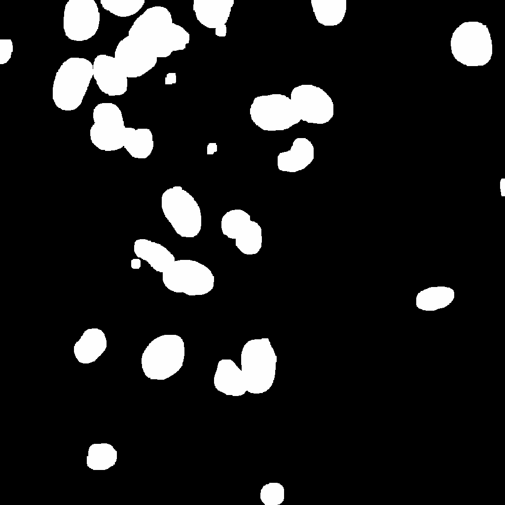

The produced dictionaries in the .npy files can then be given as input to `Fusgranule_CummingsPlot_Alldates.py` which calculates the skewnorm fit on the histogram of Fus granule intensities for each image and calculates their bootstrapped differences between conditions and produces the Cummings Plot. The .npy files from all experimental dates included in the paper are available [here.](Fusgranules/Cumulative_FUS/Example_Data)

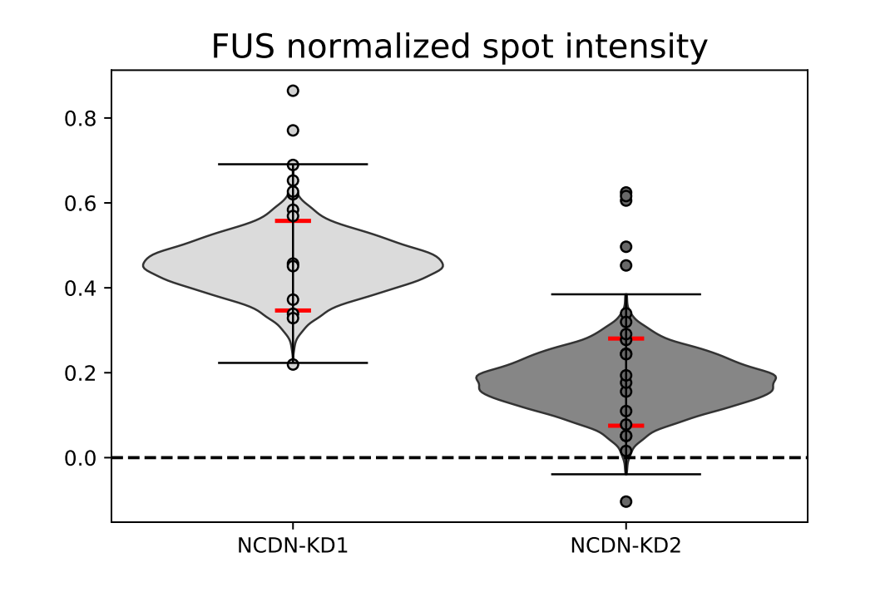

