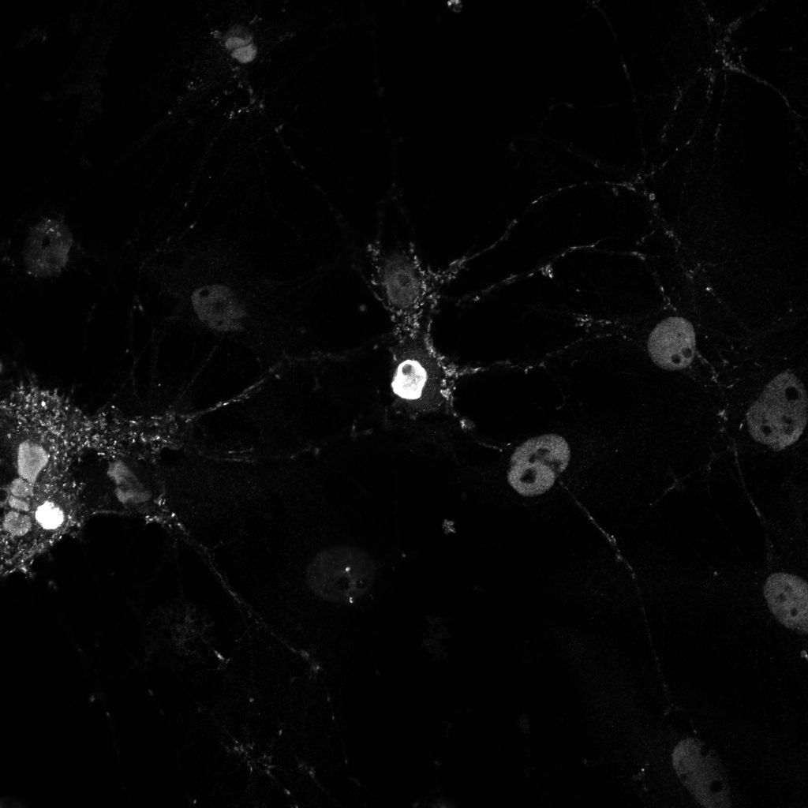

## NCDN-FUS
Analysis codes of FUS granules and cytoplasmic NCDN

# Cytoplasmic NCDN

Norbin_CytoplasmIntensity_allslices_AllCytoplasm.py must be run for each experimental week. It takes as input the path to a folder containing .lsm files from the Zeiss confocal organized in subfolders with the condition names (PLKO, shFUS315, shFUS318)

 

and returns a foreground mask, a nucleus mask and the masked intensity of the Norbin channel for each image. It also produces a csv file containing the median intensity of each image and a .npy file containing the histogram data of all the images.
  

The produced csv files can then be taken as input by NCDN_CummingsPlot_Alldates.py which calculates the bootstrapped differences between conditions and produces the Cummings Plots.

# FUS granules

Since the segmentation parameters were slightly adjusted for each experimental week, a separate python code with the appropriate parameters was produced. For example, SliceSegmentation_LSM_2shFus_3DAICS_slicequantification_Fusclusters_2021data_statsCDF.py contains all the paths and parameters to analyze the data acquired on 12-04-2021. This code takes as input the path to a folder containing .lsm files from the Zeiss confocal organized in subfolders with the condition names (PLKO, shFUS315, shFUS318, shNorbin01, shNorbin02)

 

and returns a nucleus mask and a mask of the FUS granules who respect the established thresholds for size and intensity for each image. It also returns a .npy array containing a dictionnary of the intensities of all the segmented clusters and the number of clusters for each image structured by knockdown condition.

 

The produced dictionaries in the .npy files can then be given as input to Fusgranule_CummingsPlot_Alldates.py which calculates the skewnorm fit on the histogram of Fus granule intensities for each image and calculates their bootstrapped differences between conditions and produces the Cummings Plots.

